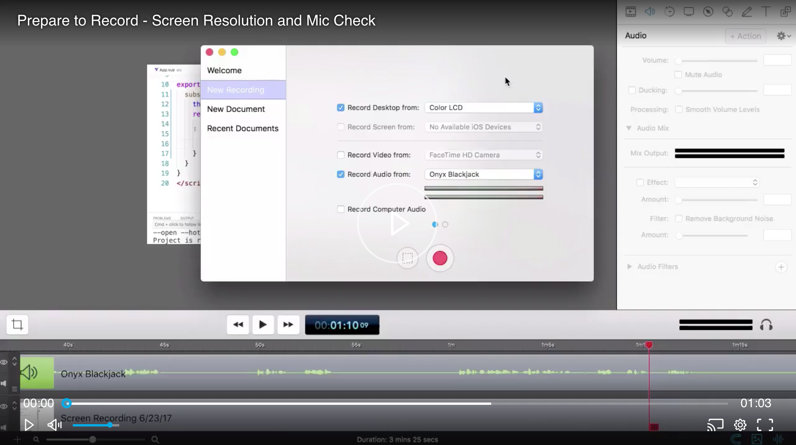

# Audio Gear Setup
Good audio starts with quality gear. You can definitely record screencasts using the built in microphone on your laptop, but we've found that our users want to have consistent high-quality audio.

We want you to sound **amazing**! Because you are.

To make this happen, we send each instructor professional grade audio recording equipment.
Once you've created a draft lesson that is *almost* ready to be published, we will ship you a case stuffed full of audio recording toys that will have you sounding awesome in no time.

This kit is minimal, and comes packed in a waterproof Pelican case. The case contains:

- K & M 23150-500-55 Tabletop Microphone Stand with 5/8" Threaded Connector and Mini Boom Arm
- Shure BETA 87A Microphone
- Shock Mount to attach the mic to the stand
- Shure X2U XLR-to-USB Signal Adapter
- 1 XLR Cable to connect the Microphone to the USB Interface
- Badass by Kathy Sierra

We will go through each piece individually and discuss what it is and why it is in the box.

## Microphone Boom

This is a stand for the mic. They come in many shapes and sizes. This is a very nice one from Germany. It is sturdy and folds down for easy storage in the box. It lets us pack everything we need into this case.

## The Microphone

Obviously an important piece of equipment! The [Shure BETA 87a mic](http://www.shure.com/americas/products/microphones/beta/beta-87a-vocal-microphone) is a `supercardioid` mic, which refers to how it pics up sound. It is forgiving and doesn't pick up ambient noise. Mics are interesting because you can go **very crazy** in terms of cost for marginal returns. We aren't producing NPR segments, and this mic is definitely in the "sounds very good" column. :thumbs_up:  

Positioning of the mic is important. Here are the recommendations:

tl;dr 

You need to be 2 to 6 inches away from the mic for optimal volume levels that will be consistent with the content on egghead.

## Shock Mount (right)

This little piece on the right connects to the boom and the microphone slides into it before being attached to the XLR cable. It will dampen any footsteps or other vibrations that might be picked up through the stand to the mic.

## USB Audio Interface (left)

This mic is built for professional audio applications and not necessarily for capturing audio on a computer. To get from the mic to the computer we need an interface that will convert XLR analog signal into 1s and 0s for the computer to store. It has an XLR input and a USB output, from the mic and to the computer, respectively.

- ⚡️ **The 48v power button needs to be on!**
- ⚡️ **Turn the gain up!**

## XLR Cable

XLR is a type of plug that is used in professional audio applications. It isn't completely necessary as the pre-amp will plug directely into the microphone.

Your final set up should look something similar to this:

## Check Audio Input Levels

Once your gear is set up, you'll need to check the audio input levels to make sure your gain is set properly.

This egghead lesson will show you how to check your audio input levels:

