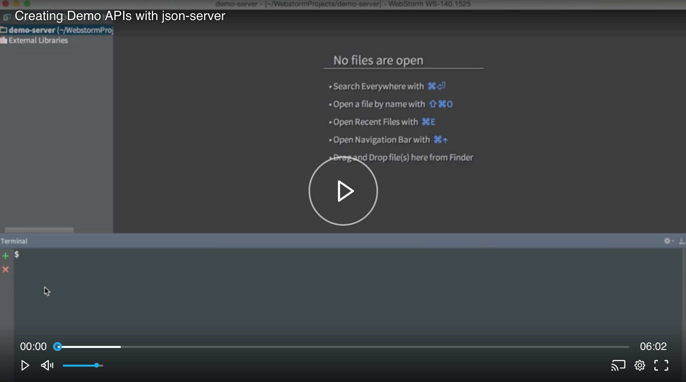

# Set up a REST API

Want data to play with in your next egghead lesson?

John set us up with a REST API using [swapi](https://swapi.co/) (The Star Wars API) and [json-server](https://github.com/johnlindquist/swapi-json-server). 

As long as there is no endorsement or promotion of swapi (or Starwars), there are no issues with copyright.

If there are no special configurations needed the server can be spun up using [npx](https://github.com/zkat/npx)

> `npx` ships with the latest versions of `npm`, so you probably already have it installed.

```bash
$ npx https://github.com/johnlindquist/swapi-json-server
// --> http://localhost:3000
```

:boom: You now have a REST API running to interact with using Starwars data.

## Build Custom data for egghead Lessons

Of course, there are endless options for building a REST API.

If your data needs to be unique for the lesson you are crafting (we have an egghead lesson for that!), John walks us through how to generate a large dataset of JSON data:
[](https://egghead.io/lessons/nodejs-creating-demo-apis-with-json-server)

## 100 Random People

If 100 random people is good enough for you, grab this gist: [gist of 100 people in json format](https://gist.github.com/johnlindquist/3a7d28dbf231c476d62dd3f481d7b1c5)

## Serve JSON locally

`json-server` will serve any JSON file we have ready.

```bash
$ npm i -g json-server
$ json-server {data.json}
```

You're ready to go.

## Host a REST API

Ziet's [now](https://zeit.co/now) is a great way to host any application needing it.

Use the app John set up:

```bash
$ npm i -g now
$ now https://github.com/johnlindquist/swapi-json-server
```

If this is your first time using `now`, there will be a small amount of set up but over-all it's a breeze.

Checkout [Deploy Web Apps with Zeit Now](https://egghead.io/courses/deploy-web-apps-with-zeit-now) for an in-depth look at `now`. :wink:
